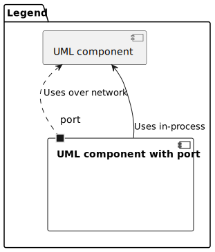
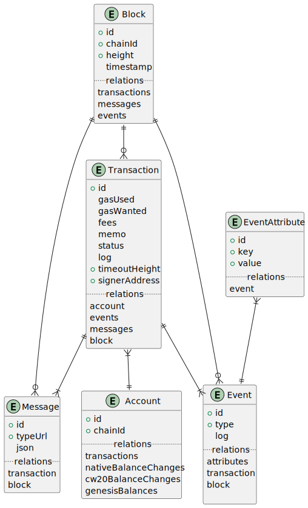
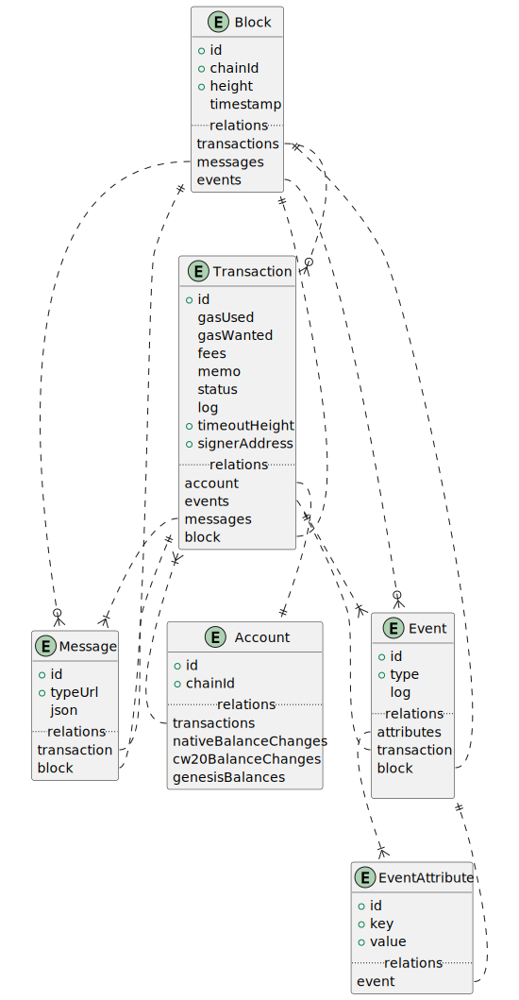

# Introduction

The ledger-subquery is a [SubQuery](https://www.subquery.network/)-based indexer for the Fetch ledger.
This indexer provides a [Graphql](https://www.subquery.network/) API for querying tracked entities.
For a list of tracked entities, see the [schema.graphql file](https://github.com/fetchai/ledger-subquery/blob/main/schema.graphql).

To learn more about how to [run](https://academy.subquery.network/run_publish/run.html) or [change this SubQuery Project](https://academy.subquery.network/quickstart/quickstart_chains/cosmos.html) to get your own custom GraphQL API for your app, [visit the SubQuery Academy for documentation](https://academy.subquery.network/). 

## Endpoints / Playground UIs

The graphql API endpoints also serve a playground UI to browsers for convenience.
This UI is useful for rapid experimentation and iteration of queries as well as just getting some results, features include:

- real-time query results
- query editor:
  - auto-complete & validation via schema introspection
  - can store multiple, named queries
  - supports graphql variables
- local persistence of query editor contents
- schema reference
- graphql docs reference

| Network | API / Playground URL |
| --- | --- |
| Fetchhub (mainnet) | <a href="https://subquery.fetch.ai" target="_blank">https://subquery.fetch.ai</a> |
| Dorado (testnet) | <a href="https://subquery-dorado.fetch.ai" target="_blank">https://subquery-dorado.fetch.ai</a> |

## Architecture

### Component Diagram




## Querying
The graphql API relies heavily on [postgraphile (as a library)](https://www.graphile.org/postgraphile/usage-library/) to resolve graphql requests.

Postgraphile plugins also play a critical role; in particular, the [connection-filter](https://github.com/graphile-contrib/postgraphile-plugin-connection-filter) and [pg-aggregates](https://github.com/graphile/pg-aggregates) plugins.

### Pagination
The graphql API implements [the connections specification](https://relay.dev/graphql/connections.htm) for pagination (see: [GraphQL pagination docs](https://graphql.org/learn/pagination/#end-of-list-counts-and-connections) for more).

!!! tip
    It is recommended to prefer using pagination operators by default (e.g. `first: <limit>`) to avoid unnecessary delays in query responses. 

### Filtering

Filtering is facilitated by postgraphile and its plugins. For specifics on supported operators and how to use them, please refer to their documentation:

- [connection-filter plugin](https://github.com/graphile-contrib/postgraphile-plugin-connection-filter)
  - [operators](https://github.com/graphile-contrib/postgraphile-plugin-connection-filter/blob/master/docs/operators.md#json-jsonb)
  - [query examples](https://github.com/graphile-contrib/postgraphile-plugin-connection-filter/blob/master/docs/examples.md)

#### Examples

Filtering `NativeTransfer`s for a given sender address:

```graphql
query nativeTransfersFromAddress {
  nativeTransfers(first: 5, filter: {
    fromAddress: {
      equalTo: "fetch1t3qet68dr0qkmrjtq89lrx837qa2t05265qy6s"
    }
  }) {
    nodes {
      toAddress
      amounts
    }
  }
}
```

Filtering for `Message`s from a given sender address:

```graphql
query messagesFromAddress {
  messages (first: 5, filter:  {
    transaction: {
      signerAddress: {
        equalTo: "fetch1t3qet68dr0qkmrjtq89lrx837qa2t05265qy6s"
      }
    }
  }) {
    nodes {
      transaction {
        signerAddress
      }
    }
  }
}
```

Filtering on `Events`s within a given timeframe and with a given type:

```graphql
query transferEventsDuring {
  events(first: 5, filter:  {
    block: {
      timestamp: {
        greaterThanOrEqualTo: "2022-09-15T01:44:13.719",
        lessThanOrEqualTo: "2022-09-19T02:15:28.632"
      }
    },
    type: {equalTo: "transfer"},
  }) {
    nodes {
      attributes {
        nodes {
          key
          value
        }
      }
    }
  }
}
```

### Order by / Sorting
Each entity, by default, can be sorted by any of its respective fields.
Additional support for ordering by certain fields on related entities is facilitated by custom ordering plugins generated from `makeAddPgTableOrderByPlugin` (see: [postgraphile-docs](https://www.graphile.org/postgraphile/make-add-pg-table-order-by-plugin/)).

#### Block height
Any entity which relates to `Block` can be ordered by a related block's `height` field:
```graphql
query contractExecByBlockHeight {
  contractExecutionMessage (orderBy: EXECUTE_CONTRACT_MESSAGES_BY_BLOCK_HEIGHT_ASC) {
    nodes {
      id,
      ...
      Block {
        height
      }
    }
  }
}
```

#### Contract Code ID
The `contract` entity can be sorted by `codeId` through the `storeMessage` and `instantiateMessage` relations.
```graphql
query contractsByRelatedCodeID {
  contracts (orderBy: CONTRACTS_BY_STORE_CONTRACT_MESSAGES_CODE_ID_ASC) {
    #  or CONTRACTS_BY_INSTANTIATE_CONTRACT_MESSAGES_CODE_ID_ASC
    nodes {
      id,
      ...
      storeMessage {
        codeId
      }
    }
  }
}
```

#### Order direction
Each of these custom orders are implemented in both directions, ascending and descending. These directions are accessed through the ending characters of the order enum, by choosing either `_ASC` and `_DESC`.

### Aggregation

Aggregation is facilitated by the [pg-aggregates plugin](https://github.com/graphile/pg-aggregates).
Features include:

- calculating aggregates
- grouped aggregates
- applying conditions to grouped aggregates
- ordering by relational aggregates
- filtering by the results of aggregates on related connections

### Tests as examples

Additional examples of queries and use cases can be found in the [end-to-end test suite](https://github.com/fetchai/ledger-subquery/blob/main/test).

## Entities

Entities tracked by the indexer exist at varying levels of abstraction. "Lower-level" entities include the [primitives](#primitive-entities) (i.e. blocks, transactions, messages, and events), upon which "higher-level" entities are constructed (e.g. LegacyBridgeSwaps).

Some entities are derived from objects which do not correspond to any network state change (e.g. failed transactions and their messages).
In the case of failed transactions, it is desirable to index the associated data for end-user reference.
This notion may also apply to other objects but should be considered carefully to avoid storing invalid or useless data.

### Primitive entities

_(see: [schema.graphql](https://github.com/ledger-subquery/blob/main/schema.graphql))_

- blocks
- transactions
- messages
- events
- event attributes

### Entity relationship diagrams





## Versioning
The versions of both the GraphQL API and the Indexer itself can be retrieved simply using the following query on the GraphQL playground.

##### Example:

```graphql
query ReleaseVersionTest {
  _metadata {
    queryNodeVersion
    indexerNodeVersion
  }
}
```

Each of these version numbers are stored as the value to the key `"version"` within their relevant module `package.json` file. These files can be found in the `docker/node-cosmos/` and `subql/packages/query/` directories for the Indexer and GraphQL versions, respectively.
```yaml
// The Indexer version number, taken from "docker/node-cosmos/package.json"
{ 
  "name": "@subql/node-cosmos",
  "version": "1.0.0",
  ...
}
```

#### `"_metadata"` Entity
The `_metadata` entity has further utility beyond the scope of the example query given prior. Using any of the relevant fields from the type definition below, internal states and config information can be retrieved with ease.
```
type _Metadata {
        lastProcessedHeight: Int
        lastProcessedTimestamp: Date
        targetHeight: Int
        chain: String
        specName: String
        genesisHash: String
        indexerHealthy: Boolean
        indexerNodeVersion: String
        queryNodeVersion: String
        rowCountEstimate: [TableEstimate]
        dynamicDatasources: String
      }
```
##### Example:
If a developer was curious about the `chain-id` or whether the Indexer has passed any health checks, using `indexerHealthy`, these values can be returned within the playground or otherwise connected projects.
```graphql
query ReleaseVersionTest {
  _metadata {
    chain
    indexerHealthy
  }
}
```